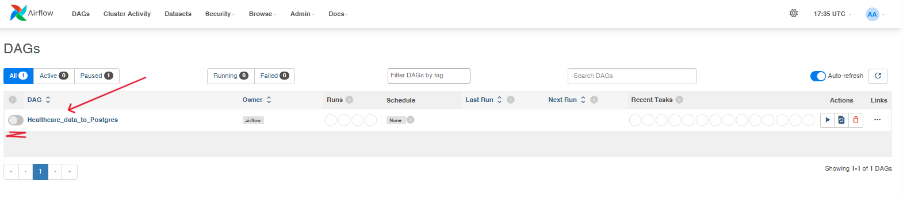
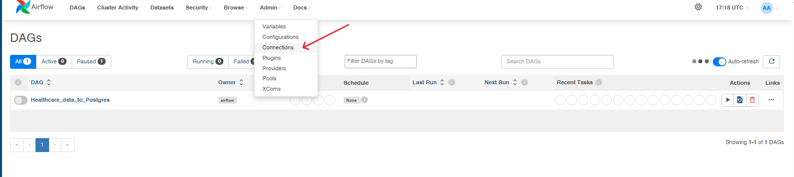
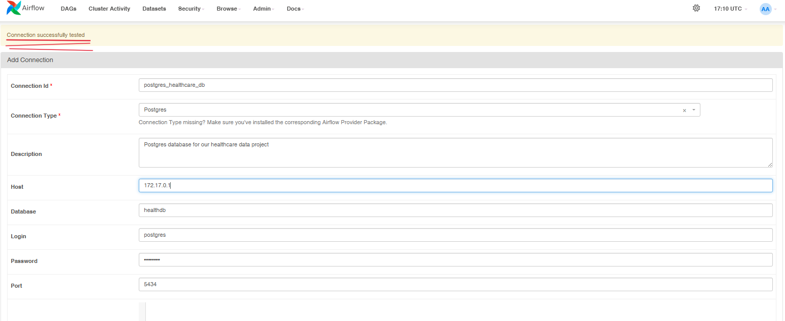
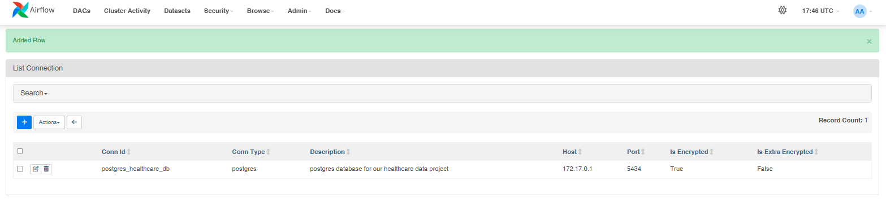
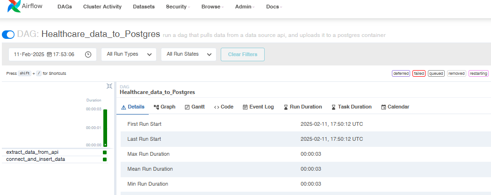
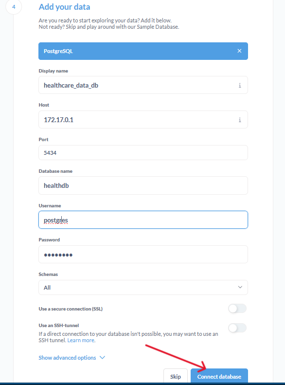
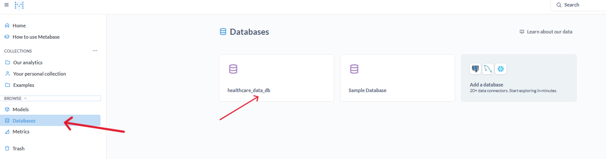
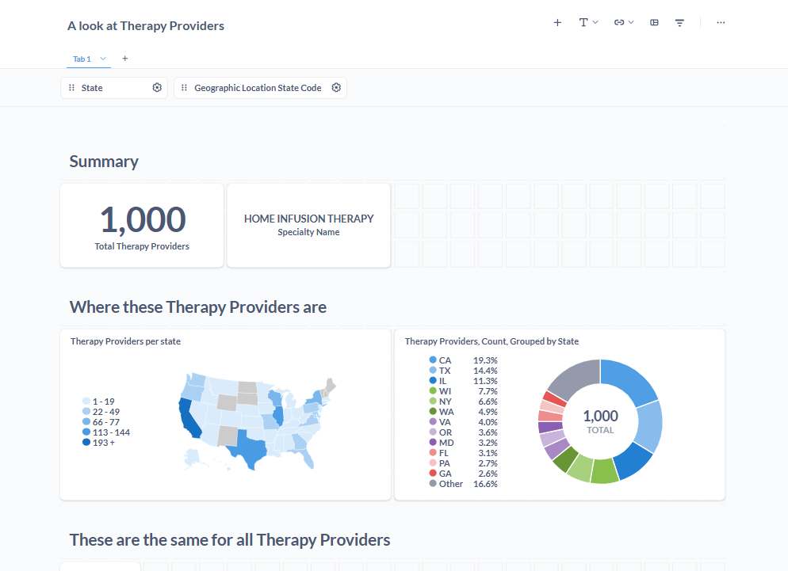

**We first initialise airflow, use this guide;**

**Step 1:** [Run Airflow Docker Compose](/README.md)

After a successful airflow run, all the dags should be visible in the Airflow UI

**Step 2:** But before you run this **Healthcare_data_to_postgres** dag, you need start two containers that will be used in our dag.
Navigate to this compose.yml file in airflow/dags/Healthcare_Data/compose.yml and run;

    $ docker compose up -d

This will initiate our postgres and metabase containers for this project.

**Step 3:** To check if the postgres database is running and accepting connection

    $ docker ps
    -- check if the container name **postgres_health** exists
    $ docker logs <container id>
    -- look for LOG: database system is ready to accept connections

**Step 4:** Next we need to test our postgres database connection in airflow UI connections before running our dag

    1. connection ID : postgres
    2. host : 172.17.0.1
    -- the host is defined in the docker compose file
    3. login : postgres
    4. password : *******
    5. port : 5434
    -- you can now test the connection
    -- airflow will display 'connection succefully tested' at the top of the webpage if well configured

save the connection if successfull

**Step 5:** You can now run the dag from airflow UI dags list
    
**Healthcare_data_to_Postgres**

A successfully ran dag will look like this;

We can now head on to our Metabase UI instance to visualise our data on port localhost:3030

Add our postgres database connection variables and connect to database as shown;

Hurray!!! We've now successfully added a direct connnection to our postgres db from the Metabase UI and ready to create some visualizations.

We can now edit our dashboard to generate business insights

